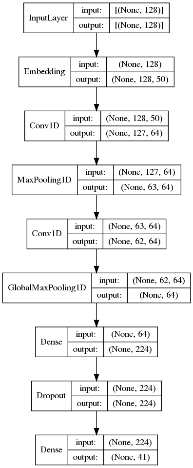

# Models
The following provides and overview of each of the models implemented in [models.py](models.py). For specific hyperparameters please refer to the [model params JSON.](model_params.json)

------------------------------------------------------------------------------------------------
## Supervised models
All of the supervised models can be run using the [run_eager.py](run_eager.py) script.

Note: Each of these can be appended with '_attn', to run their attentional variants.

- [cnn](#cnn-link)
- [text_cnn](#text_cnn-link)
- [dcnn](#dcnn-link)
- [rcnn](#rcnn-link)
- [lstm](#rnn-link)
- [deep_lstm](#deep_rnn-link)
- [bi_lstm](#bi_rnn-link)
- [deep_bi_lstm](#deep_rnn-link)
- [gru](#rnn-link)
- [deep_gru](#deep_rnn-link)
- [bi_gru](#bi_rnn-link)
- [deep_bi_gru](#deep_rnn-link)

### CNN <a name="cnn-link">
The Convolutional Neural Network is intended as a simple baseline for convolutional architectures. It consists of two convolution layers with a max pooling operation after each. We use 64 filters with a kernel size of 5 for each layer and a pool size of 8.

### Text-CNN <a name="text_cnn-link">
An implementation of the CNN for text classification proposed by [Kim, (2014)](https://www.aclweb.org/anthology/D14-1181/). It is comprised of 5 parallel convolution layers with a max pooling operation after each. Convolutional layers use the same filter size of 128 but with different kernel sizes in the range [1, 5]. The use of different kernel sizes is intended to capture the relationships between words at different positions within the input sentence. For dimensionality reduction the output of each pooling operation is concatenated before flattening into a single sequence vector.

### DCNN <a name="dcnn-link">
The Dynamic Convolutional Neural Network (DCNN) implements the model proposed by [Kalchbrenner, Grefenstette and Blunsom, (2014)](https://www.aclweb.org/anthology/P14-1062/). The DCNN uses a sequence of 3 convolutional layers, each with 64 filters, the first layer uses a kernel size of 7 and the following layers a kernel size of 5. In contrast to the previous convolutional models the DCNN uses a dynamic K-max pooling operation after each convolution, which aims to capture a variable (per-layer) number of the most relevant features. Finally, dimensionality reduction is simply the flattened output of the last K-max pooling layer.

### LSTM and GRU <a name="rnn-link">
The Long Short-term Memory (LSTM) [(Hochreiter and Schmidhuber, 1997)](https://dl.acm.org/doi/10.1162/neco.1997.9.8.1735), and Gated Recurrent Unit (GRU) [(Cho et al., 2014)](https://www.aclweb.org/anthology/W14-4012/) are simple baselines for recurrent architectures. Both models follow the standard implementation and consist of one LSTM or GRU layer with 256 hidden units. We take the output at each timestep and apply max pooling for dimensionality reduction.

##### Bi-LSTM and Bi-GRU <a name="bi_rnn-link">
The bi-directional models process the input sequence in the forwards and then backwards directions. Each pass generates a 256 dimensional vector (equivalent to the number of hidden units) per timestep, which are then concatenated to form a single 512 dimensional vector. As with the baseline recurrent models, we take the output at each timestep and apply max pooling for dimensionality reduction. 

##### Deep-LSTM and Deep-GRU <a name="deep_rnn-link">
The multi-layer models simply stack multiple recurrent layers on top of each other, with the output for a given layer, at each timestep, becoming the input for the following layer. We use the same number of hidden units and apply the same max pooling operation as the other recurrent models.

### RCNN <a name="rcnn-link">
The Recurrent Convolutional Neural Network is effectively a ‘hybrid’ of recurrent and convolutional paradigms. Our implementation is based on the model proposed by [Lai et al., (2015)](https://aaai.org/ocs/index.php/AAAI/AAAI15/paper/view/9745). The RCNN consists of two recurrent layers, each with a dimensionality of 256. One processes the sequence forwards and the other in reverse. The output of these two layers is then concatenated with the original input embedding matrix, in the format forwards-embeddings-backwards. This concatenation ‘sandwich’ is then passed as input to a convolutional layer with 64 filters and a kernel size of 1. Finally, a max pooling operation is performed for dimensionality reduction.

### Attentional Models
During parameter tuning we tested both additive attention [(Bahdanau, Cho and Bengio, 2015)](https://arxiv.org/abs/1409.0473), and multiplicative attention [(Luong, Pham and Manning, 2015)](https://www.aclweb.org/anthology/D15-1166/), and found that in all cases additive resulted in the best performance. All supervised models have an 'attentional variant', simply append '_attn' to the model name. The type of attention mechanism can be selected by setting the 'attention_type' parameter to either 'dot' or 'add'. 

## Language Models
The following can be run using the [run_graph.py](run_graph.py) script.

Note: These models need input to be strings, so to_tokens=false in the experiment_params and input_shape=(1,).

- [elmo](#elmo-link) (can also use tokenised strings)
- [albert](#albert-link)
- [bert](#bert-link) (input_shape can be max_seq_length)
- [use](#use-link)
- [nnlm](#nnlm-link)
- [mlstm_char_lm](#mlstm_char_lm-link)
- [convert](#convert-link) (requires tensorflow_text which only works on linux)

The following can be run using the [transformers.ipynb.](https://colab.research.google.com/drive/1FbdNP58IsBgBv_dq2Q8dSPckOCT5vLzo?usp=sharing) 

Note: The init_ckpt_file in experiment_params must be a valid [pre-trained model](https://huggingface.co/transformers/pretrained_models.html).

- [roberta](#roberta-link)
- [gpt2](#gpt2-link)
- [dialogpt](#dialogpt-link)
- [xlnet](#xlnet-link)

### NNLM <a name="nnlm-link">
The Neural Network Language Model, proposed by [Bengio et al., (2003)](http://www.jmlr.org/papers/volume3/bengio03a/bengio03a.pdf), pre-dates much of the contemporary work on word embeddings and should provide a useful baseline for comparison with more recent language models and our supervised models. The NNLM produces a single 128 dimensional vector for each input sentence.

### mLSTM <a name="mlstm_char_lm-link">
We include the character based multiplicative long short-term memory (mLSTM) language model proposed by [Krause et al., (2016)](https://openreview.net/pdf/ed7839937a82ca328af2ae142eec3cab39461ee9.pdf), and applied to DA classification by Bothe et al., (2018b, 2018a). We found the best performance was achieved by limiting the input sequence to 64 characters and keep the same hidden dimensionality of 4,096 used by Bothe et al., ([2018a](https://www.isca-speech.org/archive/Interspeech_2018/pdfs/2527.pdf), [2018b](https://www.aclweb.org/anthology/L18-1307/)).

### ELMo <a name="elmo-link">
Embeddings from Language Models [(Peters et al., 2018)](http://allennlp.org/elmo), is an early and successful example of generating contextual word embeddings. Consisting of a two-layer bi-directional LSTM language model, ELMo was able improve the state of the art across six NLP problems, including question answering, textual entailment and sentiment analysis. We found the best performance is achieved by using a fixed-mean pooling over each token of the output sequence to generate a 1,024 dimensional sentence vector.

### USE <a name="use-link">
The Universal Sentence Encoder [(Cer et al., 2018)](https://www.aclweb.org/anthology/D18-2029/), is intended to produce a 512 dimensional vector encoding of greater-than-word length text, such as sentences or phrases. The authors produced two versions of the USE, for this work we use the model trained with a deep averaging network (DAN) [(Iyyer et al., 2015)](https://www.aclweb.org/anthology/P15-1162/), rather than the transformer version [(Vaswani et al., 2017)](https://papers.nips.cc/paper/2017/file/3f5ee243547dee91fbd053c1c4a845aa-Paper.pdf).

### BERT <a name="bert-link">
Bidirectional Encoder Representations from Transformers [(Devlin et al., 2019)](https://www.aclweb.org/anthology/N19-1423.pdf), represents a significant step in the use of pre-trained language models based on transformer architecture. Using a masked language model pre-training objective BERT was able to improve the state of the art for 11 NLP tasks, including GLUE and SQuAD, and has since resulted in many adaptations and replications of the original architecture and training procedure. Within this work we use the BERT base model which contains 12 transformer blocks with 12 attention heads and produces a 768 dimensional embedding for each token in the input sequence. We also tested the BERT Large model but found it did not result in any significant improvements, thus we have only reported results from BERT base within this study. This also allows us to maintain a similar number of layers and parameters as other transformer models we tested, for example RoBERTa. Similarly, we tried fine-tuning different numbers of transformer layers and found the best results were achieved with all 12 transformer blocks (see the [model optimisation comet.ml project](https://www.comet.ml/nathanduran/sentence-encoding-for-da-model-optimisation/)). The final sentence encoding is then generated by an average pooling operation over all tokens in the output sequence.

### RoBERTa <a name="roberta-link">
A Robustly Optimised BERT Pretraining Approach [(Liu et al., 2019)](https://arxiv.org/abs/1907.11692), is one of the aforementioned replications studies of BERT. [Liu et al., (2019)](https://arxiv.org/abs/1907.11692), suggest BERT was ‘significantly undertrained’, and proposed several modifications, including training the model for longer on larger batches of data, training on longer sequences and removing the next sentence prediction objective. We the use RoBERTa base model which has the same architecture and output dimensions as BERT base.

### ConveRT <a name="convert-link">
Conversational Representations from Transformers [(Henderson et al., 2019)](https://www.aclweb.org/anthology/2020.findings-emnlp.196.pdf), is comprised of a dual sentence encoder architecture, which is more lightweight than other transformer based models, and is specifically optimised for dialogue tasks. ConveRT was trained on a response selection task using 654M (input, response) pairs of Reddit comments. This conversation related training objective and data makes ConveRT an interesting choice for application to sentence encoding for DA classification. ConveRT produces a single 1,024 dimensional vector for each input sequence.

### XLNET <a name="xlnet-link">
XLNet [(Yang et al., 2019)](https://papers.nips.cc/paper/2019/file/dc6a7e655d7e5840e66733e9ee67cc69-Paper.pdf), differs slightly from previously discussed models because it is intended to combine autoregressive language modelling with the more BERT-like autoencoding in order to overcome some of the limitations of both approaches. Integrating ideas from Transformer-XL [(Dai et al., 2020)](https://www.aclweb.org/anthology/P19-1285/), XLNet is able to outperform BERT on 20 tasks, including question answering and sentiment analysis. We use the XLNet base model which produces outputs with the same dimensionality as BERT base, 768 for each token in the input sequence, followed by the same average pooling operation to produce the final sentence encoding.

### GPT-2 <a name="gpt2-link">
Generative Pretrained Transformer 2 [(Radford et al., 2019)](https://cdn.openai.com/better-language-models/language_models_are_unsupervised_multitask_learners.pdf), explored the full generalisability of language models and their potential for zero-shot task transfer. That is, pre-training a language model with sufficient parameters and large amounts of data, such that it can be directly applied to downstream NLP tasks without any further fine tuning. The authors achieved state of the art results on 7 out of the 8 tested language modelling datasets in a zero-shot setting. Though GPT-2 is primarily intended for text generation tasks, its prevalence within the media and academic domain prompted its inclusion within this study. We use the GPT-2 small model which has equivalent parameters, architecture and output dimensions to the BERT, RoBERTa, and XLNet models described earlier.

### DialoGPT <a name="dialogpt-link">
The Dialogue Generative Pre-trained Transformer [(Zhang et al., 2020)](https://www.aclweb.org/anthology/2020.acl-demos.30.pdf), is an extension of GPT-2 specifically intended for conversational response generation. Similar to ConveRT, DialoGPT is trained on 147M ‘conversation-like’ Reddit comments and, given its conversational training objective and data, it is also worth assessing its performance on the DA classification task.
